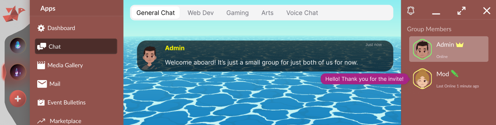

# Yumi Browser



**A peer-to-peer, post-quantum, sandboxed application platform that gives people back ownership of their digital relationships.**

Built in C11. No servers. No accounts. No surveillance. No middlemen. AGPL-3.0.

This is a **three-year project** — the work, the sweat, and the soul of a single maintainer who believes the internet can be rebuilt around people instead of platforms.

---

## The Problem

The modern internet got relationships backwards. Every space where people talk, share, and collaborate — Discord, Slack, Google Workspace, Meta, Teams — is rented from a corporation that surveils, monetizes, censors, and can pull the plug tomorrow. Billions of human relationships sit inside business models that are hostile to them. This is not a UX problem. It is a structural problem, and it will not be solved by another app on the same architecture.

## The Solution

**Yumi flips the model: the group comes first, the tools serve the group, and the data is owned by the people in it.**

Open Yumi, connect to your group, and you are inside a shared space built around the people you actually know. Chat, files, photos, video, music, livestreaming, collaborative documents, custom apps — all running locally, all encrypted end-to-end, all governed by the group itself. No platform sits in the middle. No company holds the keys. No algorithm decides what you see.

It is a browser — but for sandboxed WebAssembly applications running inside cryptographically-defined peer groups, not for the corporate web.

**Confidentiality is architectural, not advisory.** A WebAssembly webapp running in Yumi has no path to exfiltrate data outside its group. The sandbox does not expose raw sockets, arbitrary HTTP, or filesystem access — every byte a webapp sends or receives is mediated by the host and is locked inside that group's encrypted channel. This is a stronger structural confidentiality guarantee than most software shipping today, where any application can quietly phone home to anywhere on the internet.

**Networking is locked to the group, by construction.** A webapp cannot open a connection to an arbitrary peer, an arbitrary server, or another group. The host's networking layer only carries traffic inside the group the webapp is currently running for. There is no "escape hatch" API. Copying data out of a group is not something a webapp can do on its own — it requires a human in the group to manually export or screenshot, or a deliberately modified client. That risk falls under **social engineering**, not under a software-level exfiltration vulnerability: any bad actor admitted into a group can, by definition, read what they are shown, and that boundary is true of every communication tool ever built. Yumi narrows the surface to that, and not more.

**No central server means no central outage.** Every group member is a node. Connections are peer-to-peer with failover paths between members and optional, group-chosen rebroadcasters for offline catch-up. There is no company-owned backend that can go down, get acquired, or be turned off. As long as the people in your group exist, your group exists.

---

## Why This Matters

This project exists for everyone who has ever felt that their group chats, their friendships, and their communities deserve better than to be tenants in someone else’s data center. It is for users who want a tool they actually own. It is for developers who want a stable platform that will still be there in a decade. It is for granting organizations and sponsors who want to fund digital infrastructure that serves the public rather than extracts from it. The case below is the same in every direction — only the way you can help differs.

**1. The hard parts are real and working.** The cryptographic stack, the group registrar, the peer-to-peer transport, the WebAssembly sandbox host, and the GPU runtime are implemented and exercised by an extensive test suite. This is not a whitepaper. The foundation is built.

**2. Post-quantum from day one.** ML-DSA-87 signatures, ML-KEM-1024 key encapsulation, hybrid classical+post-quantum construction, Threefish-1024 / Skein-1024 symmetric layer. Built on OpenSSL plus the Open Quantum Safe project. Standards-based primitives — deployed before mainstream platforms have finished arguing about them.

**3. Architectural integrity.** Every webapp runs sandboxed in WebAssembly. The dashboard has no network access. Groups enforce membership at the protocol level, not at an application server. Moderator actions are signed and visible to every member. Removed users do not lose their social graph. These are not features bolted on — they are the structure of the system. The group registrar code is not final, but it has laid the foundation for the larger vision: an **attested group registrar** so that peer-to-peer is not a synonym for anarchy, but a system where every interaction belongs to an identifiable, signed group.

**4. Built to last decades, not quarters.** Yumi is engineered toward long-term stability with a 20-year aspirational horizon. The concrete commitment is more measured: once Yumi Browser ships its 1.0 release, after extensive testing, the project will strive to honor a **5-year stability goal** for the wire protocol, the WebAssembly API, and the group-registrar contract. Strict WebAssembly API backward compatibility is the central design objective. A group formed at 1.0 is meant to keep working as the project evolves underneath it. This is infrastructure thinking, not product thinking.

**5. Public-interest by construction.** No ads. No tracking. No telemetry. No central operator. AGPL-3.0. The project cannot moderate, censor, or monetize its users because there is no facility through which to do so. Funding Yumi funds digital infrastructure that belongs to its users by design.

**6. Independent of Big Tech rails.** No App Store, no Play Store, no platform gatekeeper. Runs on commodity hardware. The optional signaling and rebroadcast roles can be operated by anyone for a few dollars a month.

---

## What Funding And Support Enable

- Independent third-party security audit of the cryptographic stack and network protocol
- Hardening to MISRA-C and Frama-C annotated correctness across the host runtime
- Expert review of the existing documentation. The repository is in an early stage of deployment and active fixing, but a substantial body of architectural, cryptographic, networking, and threat-model documentation has already been drafted and written. It needs review by domain experts to be confirmed, corrected, and made authoritative. This is one of the most leveraged uses of funding for the project right now.
- Large-scale network testing. Hardware to stand up realistic, multi-node test environments — driven by the [GNS3](https://www.gns3.com/) network simulation project — so that the peer-to-peer transport, the group registrar, and the attestation logic can be exercised against partitions, packet loss, latency, asymmetric links, and Byzantine peers at scale. This is needed to provide real assurance against split-brain failure modes and group-attestation edge cases that cannot be reproduced on a single developer workstation.
- Completion of the user-interface migration and the first round of shipped webapps
- Accessibility, internationalization, and assistive-technology support
- Packaging and distribution work to reach non-technical users at scale
- Long-term maintenance toward the 20-year stability target

---

## Status

**Pre-alpha / alpha.** Single maintainer. Provided as-is, no warranty.

- **Core runtime, crypto, and networking:** implemented and tested.
- **WebApps: none have been published. None ship in this repository. None are available out of the box. Full stop.** The webapp layer is a separate, in-progress effort.
- **User interface:** the current stage of work is wiring the UI design into the GUI layer of the browser. Once that is done, a functioning GUI exists and the webapps that sit on top of it can be built. Expect frequent changes here during this period.
- **WebApp architecture:** webapps are designed around a clean **business-logic-layer** model — **WebGPU handles presentation, WebAssembly handles logic, DuckDB handles the data layer**. This separation is enforced by the sandbox boundary itself.
- **Network and wire protocol:** functional and exercised, but they have **not yet undergone strict third-party scrutiny**. Closing that gap is a top-priority item on the roadmap.
- **GUI toolkit:** Yumi Browser does not need to ship a public GUI toolkit for the platform to be useful. Anyone is free to use Dear ImGui, Nuklear, or any other WebAssembly-compatible immediate-mode or retained-mode toolkit, or to design their own GUI toolkit on top of the WebGPU + WebAssembly substrate.
- **Future published webapps:** webapps that are eventually published for Yumi Browser are expected to be **closed-source end products**. This is a licensing reality, not a philosophy: shipped webapps will bundle assets and depend on tooling whose licenses (paid commercial licenses for assets, confidential third-party software) only permit redistribution as part of a closed end-product. The browser itself remains AGPL-3.0; the webapps that ride on it will not all be.

## See It In Action

A short video preview of Yumi Browser's current functional state ships in this repository as [`Preview.webm`](Preview.webm). You can play it directly with any modern video player (`mpv Preview.webm`, VLC, or any browser that supports WebM) without building anything. It is the fastest way to get a feel for what the runtime looks like today.

For a hands-on look, the build also ships a **demo WebAssembly application**. After running `./build.sh`, the demo webapp is staged at `release/demo/demo.wasm` and is loaded automatically as the first-run default webapp when you launch `yumibrowser`. Running the browser is therefore enough to see the WebAssembly sandbox, the WebGPU presentation layer, and the host runtime working end to end — no extra configuration, no external network connection, and no account required.

> The *Wing It!* video content shown in the preview and in the demo webapp is © Blender Foundation, used under CC BY 4.0. See [`THIRD_PARTY.md`](THIRD_PARTY.md) for full attribution.

## On Trusting Closed-Source WebApps

A closed-source webapp on Yumi Browser is not the same risk as a closed-source application on a conventional operating system. Three things change the calculus:

1. **WebAssembly is a strong sandbox.** A Yumi webapp runs inside a Wasmer-hosted WebAssembly module with no syscall surface, no raw filesystem, no raw network, no ambient authority. Every capability it has is an explicit host-provided import, and the networking imports are scoped to its group. A closed-source webapp cannot do anything the host has not granted it permission to do — and the host does not grant permission to talk outside the group.
2. **The host enforces the boundary, not the webapp.** "Trust" in a closed-source Yumi webapp is not trust that its authors wrote benign code. It is trust in the *host runtime* in this repository, which is open source under AGPL-3.0. The host is what decides what a webapp can and cannot do.
3. **The host is designed to be auditable by non-experts.** A core, openly aspirational goal of Yumi Browser is that **anyone with minimal programming skill should be able to walk through the source code and verify the security claims for themselves** — a property Firefox and Chrome, despite being extraordinary engineering efforts, cannot offer simply because no single human can audit tens of millions of lines of C++ end-to-end. That is not a flaw of their teams; it is the structural cost of being a general-purpose web browser. Yumi is not a general-purpose web browser, and it uses that narrower scope deliberately: the host is written in plain C11, the binding modules are organized one capability per file, the WebAssembly API surface is documented header by header, and **shrinking the overall code footprint is treated as an ongoing security feature**, on equal footing with the cryptography and the sandbox. The work is not finished — the codebase is pre-alpha and active reduction is part of the roadmap — but the direction is fixed: keep the host small enough that an ordinary developer can confirm, with their own eyes, that no networking import lets a webapp reach outside its group. Self-auditability by non-experts is the bar, and the size of the code is the means.

In short: you do not have to trust the closed-source webapp. You have to trust the open-source browser that contains it, and that browser is written to be checked.

## Scope: Browser vs. WebApp Pipeline

Yumi Browser and the Yumi webapp development pipeline are **two separate projects**. The webapp pipeline is its own effort, with its own goals and its own proprietary tooling, and it is not part of this repository. Yumi Browser itself is therefore deliberately scoped to the bare necessities: a stable host runtime, a wide and frozen WebAssembly API surface, robust sandboxing, dependable cryptography, and a long-lived wire protocol. Everything above the WebAssembly boundary — editors, builders, asset pipelines, design tooling — lives in the separate webapp-development project. This separation is intentional: it lets the browser stay small, conservative, and stable for the next twenty years, while the webapp ecosystem is free to evolve at its own pace.

This repository is a clean, focused snapshot of the browser. It is intentionally separated from the larger working monorepo to keep the codebase presented here unentangled from unrelated dependencies.

---

## Build and Install

Yumi Browser is built from source on Linux. The top-level [`build.sh`](build.sh) script orchestrates everything: it bootstraps Git submodules, fetches the WASI SDK, builds every dependency under `deps/` (SDL, OpenSSL + oqs-provider, FFmpeg, FreeType, HarfBuzz, ICU, LibRaw, Wasmer, Dawn, DuckDB, Slang, bzip2, libjpeg-turbo), then compiles the project and stages a self-contained tree under `release/`.

> **Status reminder.** Yumi Browser is pre-alpha. The build is expected to work on a modern Linux developer workstation; rough edges on other distributions are likely. File an issue if you hit one.

### Prerequisites

You need a working developer toolchain on the host system. The dependency builds inside `deps/` require:

- A recent C/C++ toolchain (GCC ≥ 13 or Clang ≥ 16)
- `meson` and `ninja`
- `cmake`
- `pkg-config`
- `git` (with submodule support) and `bash`
- `python3` (used by several upstream build systems)
- `curl` or `wget` (used by `scripts/install_wasi_sdk.sh`)
- Standard build helpers: `make`, `autoconf`, `automake`, `libtool`, `nasm`, `perl`

On a Debian/Ubuntu-style system this is roughly:

```sh
sudo apt-get install -y build-essential git curl python3 \
    meson ninja-build cmake pkg-config \
    autoconf automake libtool nasm perl
```

On Fedora/RHEL:

```sh
sudo dnf install -y @development-tools git curl python3 \
    meson ninja-build cmake pkgconf-pkg-config \
    autoconf automake libtool nasm perl
```

GPU drivers with Vulkan support are required at runtime (Dawn drives WebGPU on Vulkan).

### Clone

```sh
git clone --recurse-submodules https://codeberg.org/DevNullIsaac/YumiBrowser.git
cd YumiBrowser
```

If you cloned without `--recurse-submodules`, run:

```sh
git submodule update --init --recursive
```

### Build (debug)

```sh
./build.sh
```

This is the default. It produces a debug-mode binary and assembles a self-contained release tree at `release/`. Test binaries land at `build/test_*`.

### Build (release)

```sh
./build.sh --release
```

Builds the project itself with `-O3 -DNDEBUG` and dead-code/data section stripping. Dependencies are always built in their own release configuration regardless of this flag.

### Other build flags

- `--rebuild` — wipe **all** prebuilt dependency artifacts under `deps/` and rebuild them from scratch. Useful after a toolchain upgrade.
- `--rebuild=<a,b,c>` — wipe only the listed dependencies. Names match the script files under `scripts/deps/` (e.g. `--rebuild=slang,dawn`).
- `--flatpak` — wipe prebuilt dependency artifacts and the project build tree before building, so dependencies are rebuilt against the Flatpak SDK container's glibc.

The full flag list is documented at the top of [`build.sh`](build.sh).

### Run

If `~/.local/bin` is on your `PATH`, after a successful build you can simply run:

```sh
yumibrowser
```

Otherwise run the staged binary directly:

```sh
cd release
./yumibrowser
```

A `.desktop` entry is installed by `scripts/desktop_entry.sh` so the application appears in standard launchers.

### Tests

Unit and integration tests are compiled alongside the main binary. After a build, run them individually:

```sh
cd build
./test_crypto
./test_audit
./test_yumi_client
# ... etc.
```

All test binaries are listed under `build/test_*`. New contributions that touch security-sensitive code are expected to come with corresponding tests; see [`CONTRIBUTING.md`](CONTRIBUTING.md).

### Project Documentation

- [`SECURITY.md`](SECURITY.md) — vulnerability reporting policy
- [`CONTRIBUTING.md`](CONTRIBUTING.md) — how to contribute
- [`CODE_OF_CONDUCT.md`](CODE_OF_CONDUCT.md) — community rules
- [`THIRD_PARTY.md`](THIRD_PARTY.md) — vendored third-party source and its licenses
- [`AUTHORS`](AUTHORS) — maintainer and contributors
- [`CHANGELOG.md`](CHANGELOG.md) — release history

---

**Yumi Browser is a browser for your friends — not for websites, not for corporations, for people you actually know. Whether you use it, build on it, contribute to it, or fund it: help us build it.**
